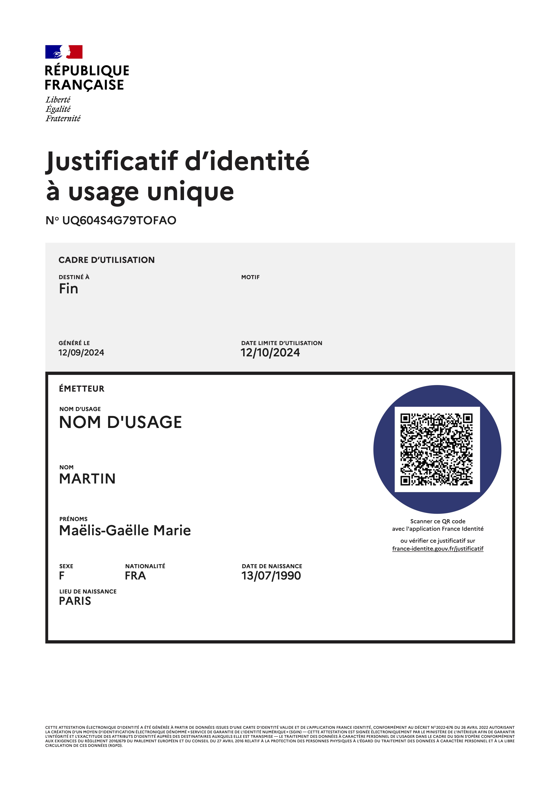



# VDS Verify

Encodage et décodage de Visible Digital Seal - VDS, de Cachet Electronique Visible CEV et de 2D-Doc.

## App mobile

`VDS Verify` est une application mobile (Android et iOS) de décodage et de vérification de Cachet Electronique Visible (CEV, VDS et 2D-Doc). Elle permet de décoder et vérifier les CEV (datamatrix et QR Code) selon les spécifications :

- 2D-DOC

Il 'agit des spécifications techniques pour la création et la vérification des CEV utilisés par l'[Agence Nationale des Titres Sécurisés](https://ants.gouv.fr/nos-missions/les-solutions-numeriques/2d-doc) (ANTS). On retrouve ces CEV sur les cartes nationales d'identité, les factures d'énergie, les tests COVID, les vignettes Crit'Air, etc.

- CEV ISO 22376:2023

[https://www.iso.org/standard/50278.html](https://www.iso.org/standard/50278.html)

- CEV AFNOR XP Z42-105

[https://www.boutique.afnor.org/fr-fr/norme/xp-z42105/specifications-relatives-a-la-mise-en-oeuvre-du-cachet-electronique-visible/fa199910/238577](https://www.boutique.afnor.org/fr-fr/norme/xp-z42105/specifications-relatives-a-la-mise-en-oeuvre-du-cachet-electronique-visible/fa199910/238577)

<table cellspacing="0" cellpadding="0"><tr>
<td></td>
<td></td>
</tr></table>

## Notre solution de création de CEV

L'application mobile s'appuie sur notre API de création, encodage, signature et de décodage, vérification de CEV. Elle permet notamment de démontrer les capacités de notre API à décoder et vérifier les CEV créés par notre solution de création de CEV.

### Ils l'utilisent

Notre solution de création, encodage et signature électronique de CEV (aux formats AFNOR et ISO) est la seule solution aujourd'hui utilisée en production. Elle est notamment mise en oeuvre par le Ministère de l'Intérieur pour la création des CEV :

- apposés sur le [justificatif d'identité](https://france-identite.gouv.fr/justificatif/) de l'application [France Identité](https://france-identite.gouv.fr/),
- utilisés par l'application [France Identité](https://france-identite.gouv.fr/) pour la [présentation de son identité en face à face avec la SNCF](https://france-identite.gouv.fr/actualite/experimentation-SNCF/).

### Fonctionnalités avancées

Notre solution de création de CEV permet de créer des CEV selon les _manifests_ définis et de les signer électroniquement avec un certificat électronique qualifié.

- Conformité au standard ISO 22376:2023
- Conformité au standard AFNOR XP Z42-105
- Gestion des manifest
- Gestion des certificats et des clés de signature électronique
- Compatibilité avec les HSM (Hardware Security Module) lors de la signature du CEV

### Exemple

#### Justificatif d'identité - France Identité

